# TDP029 Project - Träningsdagbok

## Contents
1. [Introduction](#1-introduction)
2. [Installation](#2-installation)
3. [Functionalities](#3-functionalities)
4. [Technologies & Libraries](#4-technologies-libraries)
5. [File Structure](#5-file-structure)
6. [Good to Know](#6-good-to-know)

#### Document Links
[Technologies: Versions & Documentation](./documentation/TechnologiesLibraries.pdf)  
[Components & Services: Description](./documentation/ComponentsServices.pdf)

## 1. Introduction
This web application is a Training Log intended as a widget for the Zoezi Gymsystem. The Training Log is dependent on the Zoezi Gymsystem by design as it is built to log gymsystem workouts. The app is built using technologies such as Vue.js, Bootstrap, Flask and MongoDB. 

This document will go through how to install the app in a development environment, app functionalities, technologies and libraries used, how the project is structured (file structure), and a few tips and tricks that could potentially be good to know.

## 2. Installation
This part of the document will explain how to install and run the app in a development environment.

First thing you need to have git installed to be able to download the project. It is also neccesssary to be a contributor on the git repository since it is set to private for now. To download the project navigate to a folder where you want the project to be saved and then execute the following command:

`git clone git@github.com:WilhelmHandberg/TDP029-Zoezi.git`

Now you should have the project downloaded and you should be able to navigate to the root folder of the project:

`cd TDP029-Zoezi/`

### Frontend
To install the frontend part of the project you will need to have npm installed on your computer. when npm is installed the first thing you want to do is install the @vue/cli package globally. You do that using this command:

`npm install -g @vue/cli`

Now that @vue/cli is installed globally it is time to navigate to the frontend folder:

`cd frontend/`

Now that you are in the root folder for the vue project you can install all the packages and dependencies using the following command:

`npm install`

Now that everything is installed you can run the vue project on a local development server using this command:
**To make the app externally visible:**
`sudo PORT=80 npm run serve --public`

**To run locally:**
`npm run serve`

Now you have the frontend part of the project up and running. Next up is how you install and run the backend part of the project.

### Backend

#### Installation
**In the backend folder:**
 * Install Python 3.8.x and make sure PIP is working.
 * Run `pip3 install -r requirements.txt`
 * Set up a MongoDB server on a preferred platform and save the access details.

#### Preparation

**In the backend folder:**
Configure the Flask app (Session configuration and CORS) in app.py. 
**IMPORTANT!!:** HTTPS has not been implemented, be sure to add it before deploying the app since passwords are sent in plaintext and only encrypted on the server!
In `db_manager.py`, enter the MongoDB connection URL in the `DBM.connect()` function as a parameter to `pymongo.MongoClient( URL )`.

**Google**
* Register an app in the Google developer console.
* Under Project settings -> Credentials, click Create Credentials -> OAuth Client ID. Finish the process and find the values for *Client ID* and *Client Secret* in the new entry under “OAuth 2.0 Client IDs” in Credentials. They also need to be entered in their respective keys in the configuration inside the `g_get_refresh_token()` and `g_get_access_token()`, along with the redirect_uri. Do not forget to leave the “/google” route after the redirect uri as it is needed to identify the right authentication in the frontend. The redirect uri is the URL to the frontend Vue application.

The “/current” route in `user_api.py` is responsible for getting the workouts for a user from a zoezi web application. In the current route you will have to change the `url` variable to the correct web application. 

**Fitbit**
* Register an app on dev.fitbit.com with the correct website information and get the callback URL and OAuth 2.0 Client ID from the registered app, found under Manage My Apps. 
* Use these in `api_api.py` in the function `f_get_refresh_token()` to replace the `Client_Id` and redirect_uri. Do not forget to leave the `/fitbit` route after the redirect uri as it is needed to identify the right authentication in the frontend.
* You will also need to go to the OAuth 2.0 tutorial page in the registered app. There you should follow the first instructions up to pasting the code in step 1A, then get the authorization code from the generated curl and replace the existing authorization in the `f_get_access_token()` function in `api_api.py`

Finally add links to OAuth consent pages for both google and fitbit to connectGoogle() and connectFitbit() methods in UserSettingsSection.vue (frontend component)

#### Running
The following commands will run the development environment, to run the production environment, please consult the relevant documentation for each system.
**To make the app externally visible:**
`flask run --host=0.0.0.0 --port=5000`

**To run the app locally:**
`flask run --port=5000`

## 3. Functionalities

### Login & Register

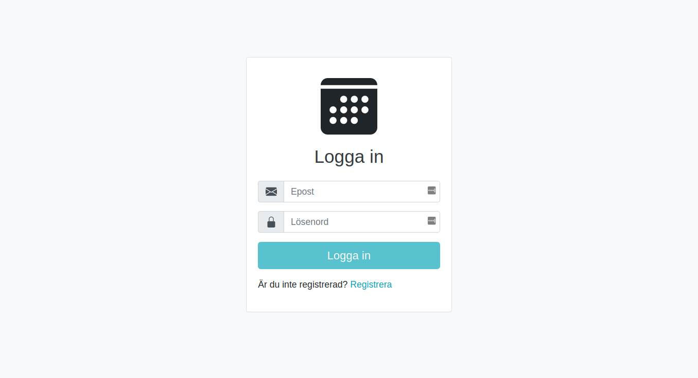

The first page encountered is a simple page for logging in or registering. You can only log in via email address, but you need to register with an email address and username.

### Welcome Page

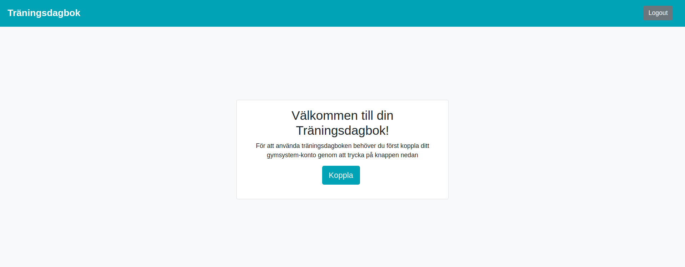

This is the page that a user who have not yet connected his/her gymsystem account to their account on "Träningsdagbok". There is a welcome message and a button which leads to a form to connect to gymsystem. You are able to logout if you want but you can not reach any other page of the app.

### Header

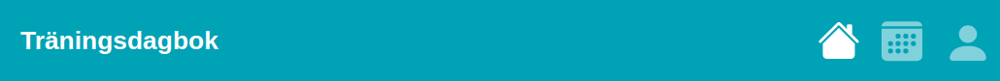

The header contains an unclickable icon on the far-left, and three clickable icons on the far-right. You navigate to the three different pages via these icons: Dashboard, Calendar and User Settings. The header is only visible during a logged in session.

### Dashboard

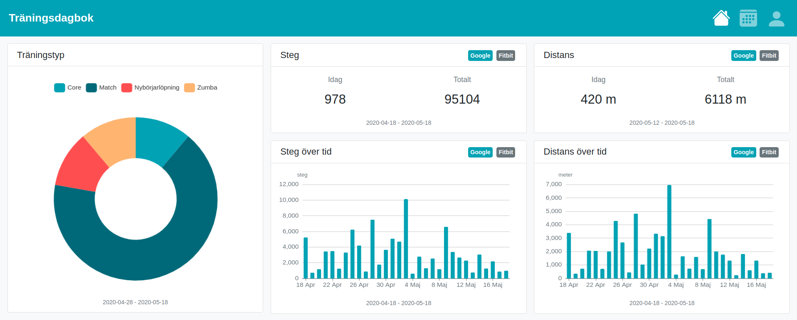

If you’re registered and connected you will be taken to the Dashboard page which serves as the start page for the app. Dashboard contains three charts: a donut chart which contains how many minutes you’ve spent on various workouts, a bar chart for your steps taken, a bar chart for your distance travelled in meters, in addition to two cards representing your steps and distance daily and in total. The data presented in the bar charts and two cards is based on data imported from Google Fit or Fitbit and you can flip between the data from either of these in the cards or charts themselves by clicking “Google” or “Fitbit”. The timespan of the data showed is located underneath each dashboard box. Sometimes the donut chart will have a "Övrigt" category and at this time it is possible to hover over this category in the donut chart and see a tooltip containing all workout types that have been put in the "Övrigt" category. The bar charts show data for the last month but if you want to see fewer days it is possible to zoom in using a scroll wheel.

### Calendar

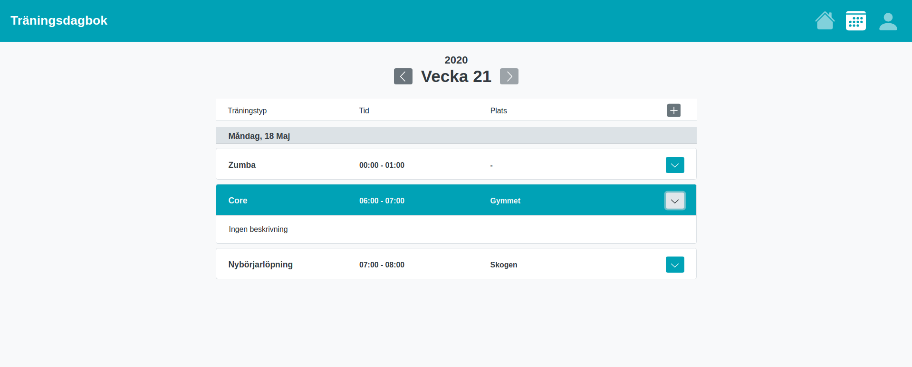

The Calendar contains all the workouts you are registered to on the Zoezi gymsystem in addition to any workouts you’ve manually added via this calendar. The calendar shows one week at a time and all the days of that week that have booked workouts. You can view previous weeks and the current week but you cannot view future weeks. The workout information shown is the workout type, the time the workout starts and ends and the location. You can click the arrow on the far-right of the workout’s tab in the calendar to see its description.

You can add a new workout by pressing the arrow button located on the far right of the calendar header. It will present a pop-up window where you pick a date for the workout to take place, the workout type(you can add a new type or choose an existing type) start time and end time, location, description. 

### User Settings

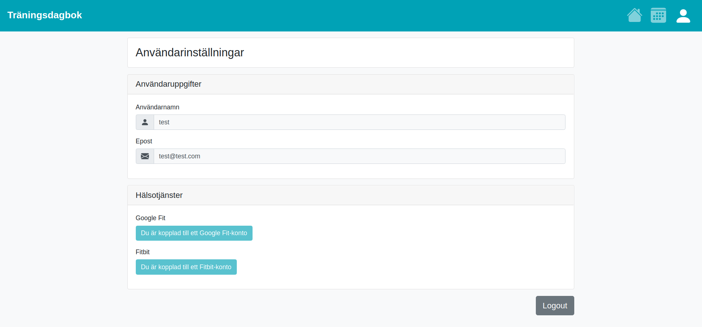

The user settings page contains two containers. One holds the user information. In the current version only the username and email is presented. We had plans to implement the ability to change both email and username, but for now they are presented as non editable text fields. These text fields can easily be made editable and the functionality for changing username and email can then be added if preferred. It would also make sense to add the functionality of changing password if the former functionality was to be added.

The next container presents you the ability to connect your account to a Google Fit account and/or a Fitbit account. Some of the data from Google Fit and Fitbit is then used on the Dashboard page.

### Error Page

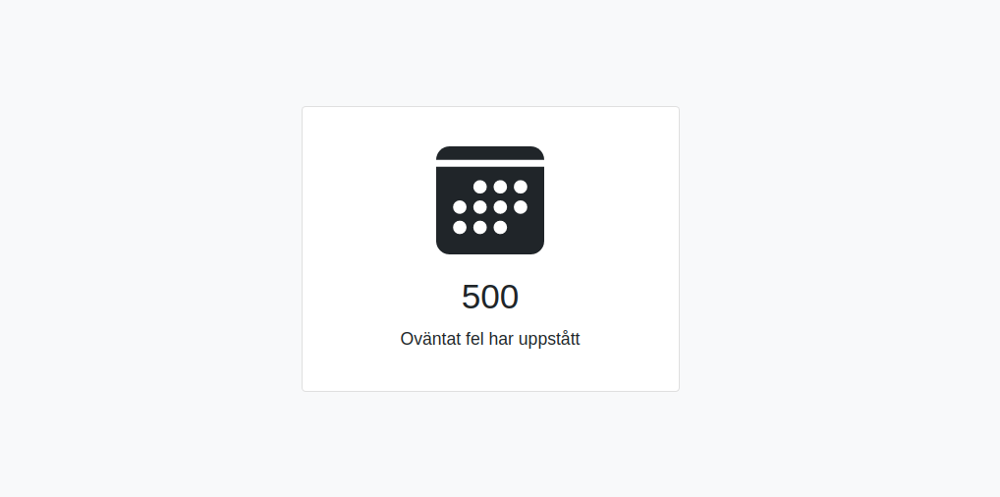

This page will only be shown if any unexpected error would occur. This will also log out the user currently using the app.

## 4. Technologies & Libraries
In the PDF below are all technologies and libraries we have used to build this app. There is information on name, version, documentation link and som extra info on how we have used said technology or library.

[Technologies: Versions & Documentation](./documentation/TechnologiesLibraries.pdf)

## 5. File Structure
Below is an explanation of the frontend and backend file structure, including what functionalities are contained within each file and how a file relates to other files.

### Frontend
Since the frontend is built using Vue.js the file structure consists of vue components. Most of the code, such as HTML, CSS and Javascript, goes in these components . We have chosen to put the code regarding requests to other APIs (mainly to our backend) in separate files that we call “Services”. These services are used within the components to asynchronously fetch data from said APIs.

Below are a few diagrams showing how components and services relate to each other as well as a short description of a few important files that does not fall into any of these two categories.

For a more detailed description of the components and services see the link below:

[Components & Services: Description](./documentation/ComponentsServices.pdf)

#### Components

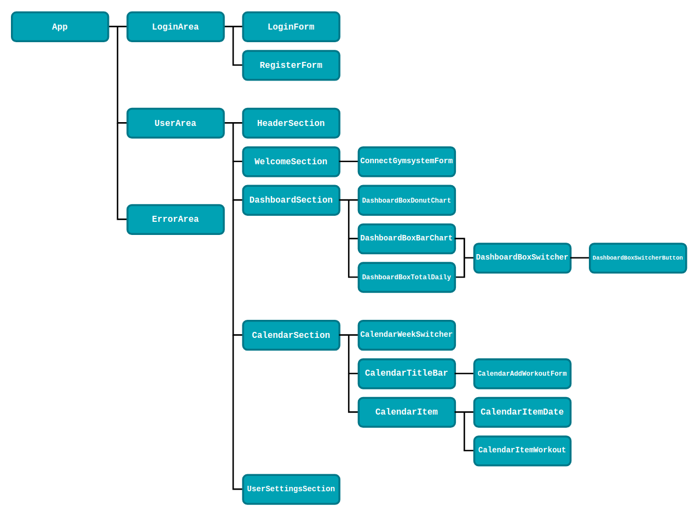

#### Services
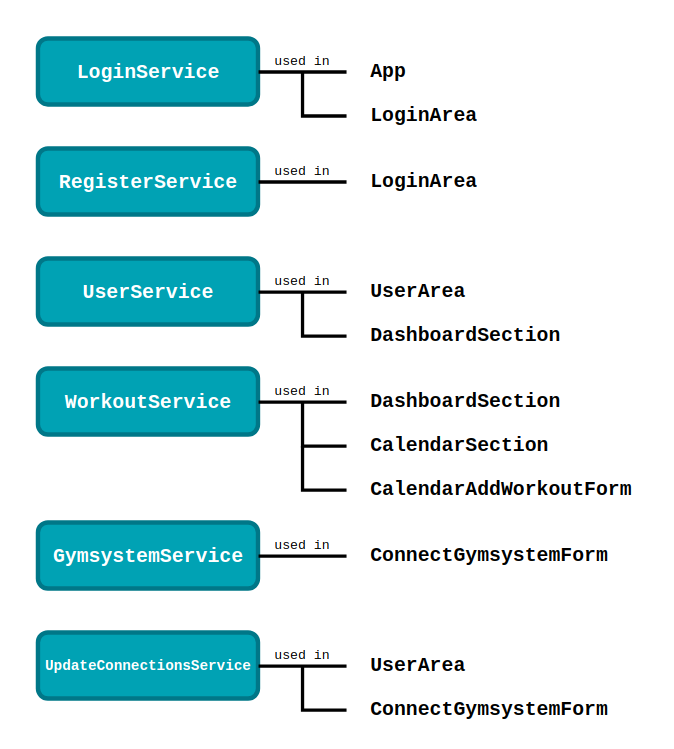

#### Important Files
**main.js**
This is the file where all the libraries used in Vue are being imported. This is also where the Vue instance is instantiated.

**url.js**
This file contains two variables representing urls. One is called backendUrl and should contain the url to where the backend is currently running. The other one is gymsystemUrl which should contain the url to the an instance of gymsystem. 

### Backend
####File Structure
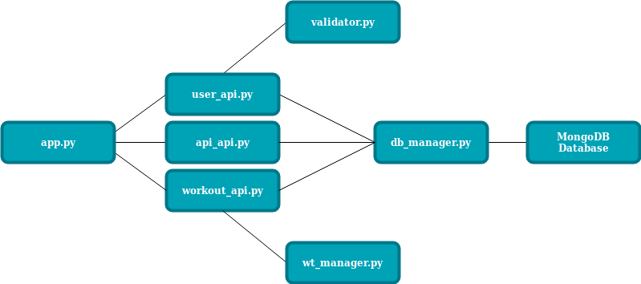
####Files
**app.py**
Root file for the Flask application. Contains global config, Cors and makes the routes available.

**db_manager.py**
This is the file that manipulates the MongoDB database. All the functions that get, set or update data are located here. Most of the functions here are called from the routes in the app, however some are helper functions that are only used within this file.

**user_api.py**
Contains functions that handle all routes under /user/\<endpoint\>. This includes account functionality (login/register) and retrieval of user data.

**api_api.py**
Contains functions that handle all routes under /user/api/\<endpoint\>. This includes Fitbit and Google Fit authorization and retrieval of steps and distance data.

**workout_api.py**
Contains functions that handle all routes under /user/workout/\<endpoint\>. Manages workout adding and retrieval.

**wt_manager.py**
Class that standardizes workout objects from various sources by parsing data into specific member variables. Works likes a filter before workout insertion into the database.

**validator.py**
Contains functions for validating username, password, email, and checking for invalid characters.

**requirements.txt**
Python requirements file that contains the required packages for the app together with the used versions. The file supports automatic install of required packages by running `pip3 install -r requirements.txt`. This file has not been extensively tested and may be missing packages.

####Api Documentation
The available routes for the application are listed in the API Documentation pdf that can be found here: [Api Route Documentation](./documentation/API_Documentation.pdf)

## 6. Good to Know

### GymSystem permissions
For the app to work with the Zoezi APIs, all users in the GymSystem need to be equipped with a role that contains the *Show schedule* and *Workout booking* permissions.

### HTTPS
The app is not configured to use HTTPS. Since it sends critical data like passwords and emails in plaintext, it must be encrypted with HTTPS before it is deployed to a production environment. This should be configured in the flask portion, and all relevant URLs must be updated accordingly.

### Color Palettes
Below are the color palettes used in the app

#### Main
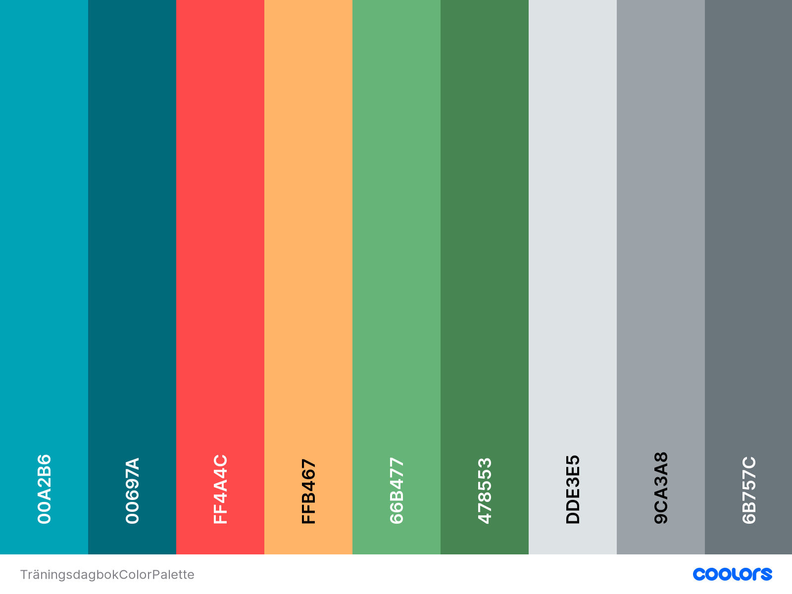

#### Validation
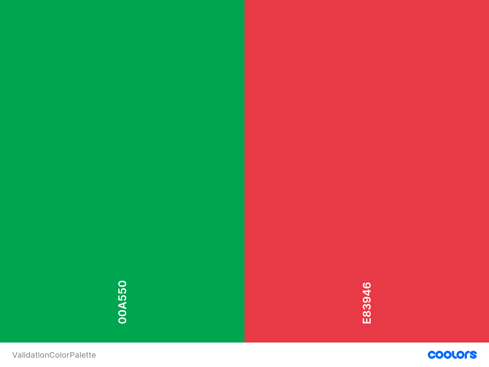

### The /current route:
The `/current` route will use the `/api/workoutBooking/getEarlierForMember` call from the zoezi api. As long as the zoezi API stays the same only the url will have to be changed. Observe that the zoezi API will not be called every time the `/current` route is being called as there is a timer on the external API calls to speed the process up and avoid spam updates. To disable the timer for debug purposes comment out the row `db.update_time(user_id)`. To increase or decrease the timer change the amount of minutes in the `timer_limit` variable.

### Google API Playground
https://developers.google.com/oauthplayground/
A useful tool for playing around with Google's API to understand the procedure and permissions needed to make a request.
